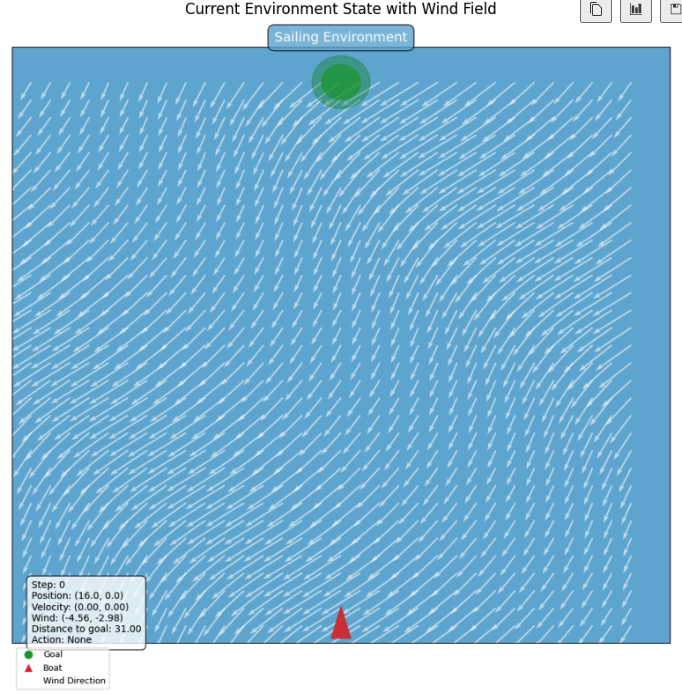

# SAILING CHALLENGE


## Getting Started

To get the challenge materials, clone this repository to your local machine using:

```bash
git clone https://github.com/trahier/RL_project_sailing.git
cd RL_project_sailing
```

## Challenge Presentation

Welcome to the Sailing Challenge! Your mission is to develop an intelligent agent capable of navigating a sailboat from a starting point to a destination under varying wind conditions. This environment simulates sailing physics where the boat's movement is influenced by wind direction and intensity, requiring strategic planning to reach the goal efficiently.

**IMPORTANT**: This challenge requires you to submit a pre-trained agent (policy) that maps observations to actions, NOT a learning algorithm. Your submitted agent should be a fixed mapping from states to actions that makes decisions based on the current observation without further learning during evaluation. All training and policy improvement must be completed before submission. Think of it as submitting a finished product rather than an evolving algorithm.

The challenge provides 3 training initial windfields with different wind patterns. Your agent will be evaluated on both these training initial windfields and a hidden test initial windfield to assess its ability to generalize to new conditions.



The sailing environment features:
- A grid-based world where the boat must navigate from the starting point (bottom center) to the goal (top center)
- Realistic wind fields that vary spatially and temporally
- Physics-based boat movement influenced by wind direction and strength
- Success depends on understanding sailing physics and adapting to changing wind conditions

### Installation Requirements

To set up the environment, we recommend using a virtual environment:

```bash
# Create a virtual environment
python -m venv venv

# Activate the virtual environment
# On Windows:
venv\Scripts\activate
# On macOS/Linux:
source venv/bin/activate

# Install dependencies
pip install -r requirements.txt
```

### Challenge Walkthrough

We recommend exploring the notebooks in the following order:

1. **challenge_walkthrough.ipynb**  
   Introduction to the sailing challenge, environment mechanics, and agent interaction. This notebook presents the 3 training initial windfields and explains how your agent will be tested on an additional hidden initial windfield.

2. **design_agent.ipynb**  
   Learn how to develop your own sailing agent. This notebook guides you through creating either rule-based agents or training reinforcement learning agents, including a simplified Q-learning implementation that uses only local information (position, velocity, local wind). The notebook also provides guidance on extending this agent to consider the full wind field for better performance. Use this notebook to create your submission file.
   
3. **validate_agent.ipynb**  
   Test that your agent implementation meets the required interface. Ensure your agent is valid before submission.
   
   Command line equivalent:
   ```bash
   cd src
   python test_agent_validity.py path/to/your_submission.py
   ```

4. **evaluate_agent.ipynb**  
   Evaluate your agent's performance across different initial windfields and understand the metrics used for grading.
   
   Command line equivalent:
   ```bash
   cd src
   # Evaluate on a specific training initial windfield
   python evaluate_submission.py path/to/your_submission.py --initial_windfield training_1 --seeds 42 43 44
   
   # Evaluate on all training initial windfields
   python evaluate_submission.py path/to/your_submission.py --seeds 1 2 3 4 5
   ```

## Submission Instructions & Grading

### Submission Format

Your submission should consist of a **single Python file** containing your agent implementation. The file must:

1. Define a class that inherits from `BaseAgent`
2. Implement all required methods: 
   - `__init__`: Initialize your agent (must accept no required arguments)
   - `act(observation)`: Choose an action based on the observation (must return an integer from 0-8)
   - `reset()`: Reset the agent's state for a new episode
   - `seed(seed)`: Set the random seed for reproducibility
3. Be validated using the validation tool provided

Remember that your submission should be a pre-trained agent that can make decisions based on the current state without further learning. All training should be completed before submission.

**IMPORTANT**: Submissions should follow the naming convention:
```
lastname_firstname_submission01.py
```
Use sequential numbering for multiple submissions (e.g., `lastname_firstname_submission02.py`).

### Validation

Before submitting, validate your agent:

```bash
cd src
python test_agent_validity.py path/to/your/lastname_firstname_submission01.py
```

The validation script will check that your agent:
- Properly inherits from BaseAgent
- Implements all required methods
- Can be instantiated without arguments
- Returns valid actions (integers 0-8) when given observations

### Evaluation

Your agent will be evaluated on:

```bash
cd src
python evaluate_submission.py path/to/your/lastname_firstname_submission01.py --include-test
```

### Submission Link

When your agent has been validated and evaluated, submit it using the following Google Form:

**Submission Form**: [https://forms.gle/nZCXLW5auGD56s8YA](https://forms.gle/nZCXLW5auGD56s8YA)

### Grading Criteria

Your submission will be evaluated based on:

1. **Agent Validity (Pass/Fail)**: Your agent must pass validation checks
2. **Training Initial Windfield Performance**: Performance across the three training initial windfields
3. **Test Initial Windfield Performance**: Performance on the hidden test initial windfield

The final grade will be calculated based on a weighted combination of these factors. An agent that successfully reaches the goal in all three training initial windfields is already on track to achieve a strong grade.

**Note**: A valid agent that can consistently reach the goal in all training initial windfields will already have a grade close to the median. Exceptional performance on the test initial windfield and creative approaches can further improve your grade.

### Challenge Timeline

- **Duration**: 3 weeks (until Wednesday, May 21st at midnight)
- **Submission Limit**: Maximum 4 submissions per week
- **Leaderboard Updates**: Mondays and Thursdays (showing performance on the test initial windfield)

All submissions will be evaluated on both training and test initial windfields, but test initial windfield results will only be shared during leaderboard updates. This prevents overfitting to the test initial windfield while still providing feedback on generalization ability.

### Communication

There will be two dedicated threads in the class Slack for this challenge:
- **Leaderboard Thread**: Weekly updates on agent performance on the test initial windfield
- **Questions Thread**: For questions related to the challenge

We encourage students to help each other by answering questions when possible. The evaluator will dedicate 1-2 hours twice per week to address unanswered questions and provide clarification.

## Good Luck!

Start by carefully reading through the notebooks in the recommended order. By the time you complete the design_agent notebook, you should have a good understanding of how to create an effective sailing agent.

Remember that sailing efficiently requires adapting to wind conditions - the shortest path is rarely the optimal one in sailing!